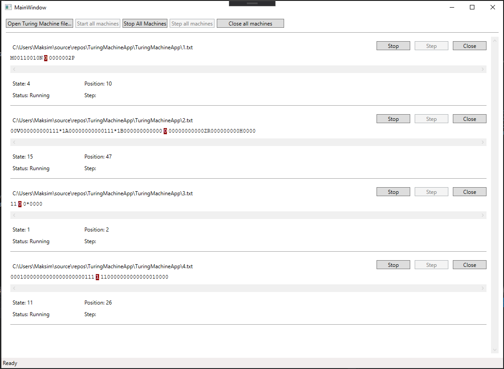

# TuringMachineApp
University project
[Turing Machine on Wikipedia](https://en.wikipedia.org/wiki/Turing_machine)

## Screenshot:

## Features:
* Turing machine halts (stops execution) when there's no command to execute
* Shows the number of steps performed, current state, status (idle, running, done)
* Can run several turing machines simultaneously
* Project folder contains 4 examples (`[1-4].txt`)

## File format:
* File must contain 3 or more lines
* First line contains turing machine tape
* Second line contains machine's current position
* Rest of the file contains machine instructions

## Command format:
* Line that defines command must contain 5 tokens as follows:
* Current state, 1 or more characters are allowed.
* Current symbol, only one character.
* New symbol, only one character.
* Direction, 'L' or 'R'.
* New state, 1 or more characters.
